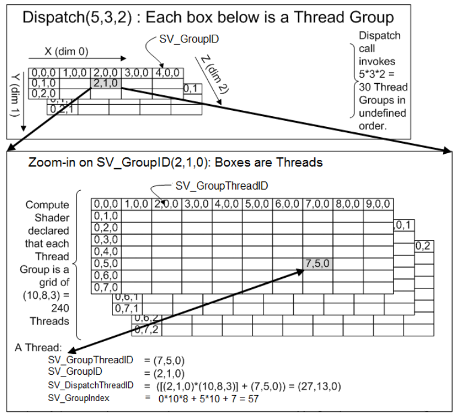

In unity, create a Compute Shader, the template is like this
```c
// Each #kernel tells which function to compile; you can have many kernels
#pragma kernel CSMain

// Create a RenderTexture with enableRandomWrite flag and set it
// with cs.SetTexture
RWTexture2D<float4> Result;

[numthreads(8,8,1)]
void CSMain (uint3 id : SV_DispatchThreadID)
{
    // TODO: insert actual code here!

    Result[id.xy] = float4(id.x & id.y, (id.x & 15)/15.0, (id.y & 15)/15.0, 0.0);
}
```

The CS writes output to `RWTexture2D`, which in unity must bind to a **[RenderTexture](https://docs.unity3d.com/ScriptReference/RenderTexture.html)** with enableRandomWrite flag, see [RenderTexture.enableRandomWrite](https://docs.unity3d.com/ScriptReference/RenderTexture-enableRandomWrite.html).

Use [cs.SetTexture](https://docs.unity3d.com/ScriptReference/ComputeShader.SetTexture.html) to set a texture parameter for the CS.

## Kernel, Threads
### Kernel
_kernels_,  are funtions **executed N times in parallel by N different threads**, as opposed to only once like regular functions.

### Thread Group
#### What is thread group?
reference to [logical group size and hardware group size](https://www.gamedev.net/forums/topic/684530-compute-threads/)  \
The point of a thread-group is:  \
A) they can communicate with each other by using group-shared memory.  \
B) they should somewhat match the way that the hardware works (8-64 "threads" being executed in lockstep on a SIMD architecture).

#### numthreads
`[numthreads(8,8,1)]`: size of a ThreadGroup

#### Semantics

`Dispatsch(5, 3, 2)`:  run 5x3x2 Thread Groups in total\
`SV_GroupThreadID`: **index** of the thread **inside the Group**\
`SV_GroupID`: **index of the Group** which the thread belongs to\
`SV_DispatchThreadID`: **index among all threads**\
`SV_GroupIndex`: **1D index** of the thread **inside the Group**
```
SV_GroupIndex = SV_GroupThreadID.z*dimx*dimy + SV_GroupThreadID.y*dimx + SV_GroupThreadID.x
```


## Examples
### Irradiance Map
[Generate Irradiance Map]()

