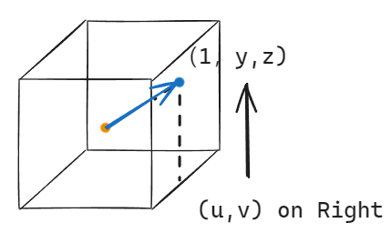
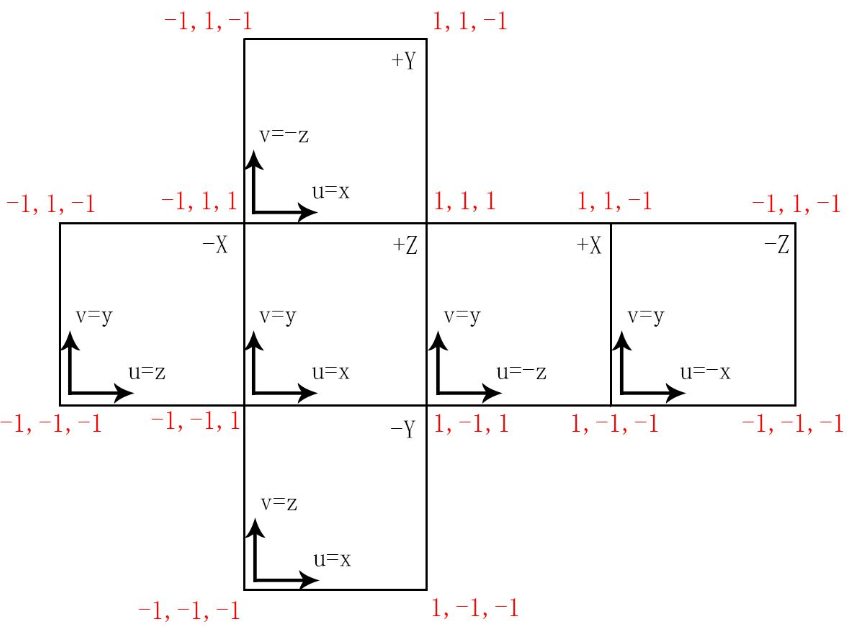
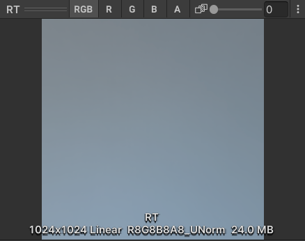
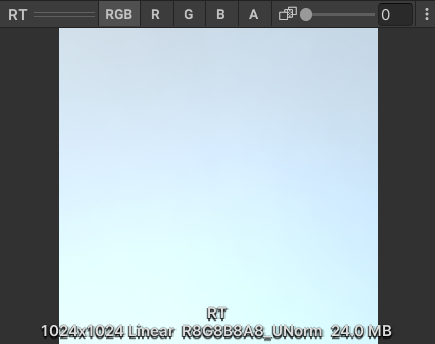
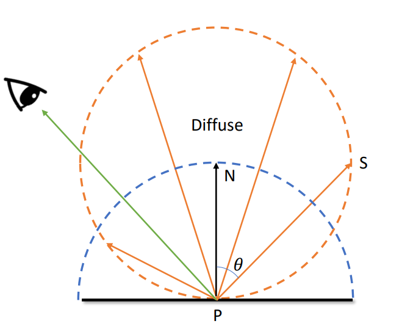
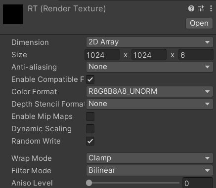
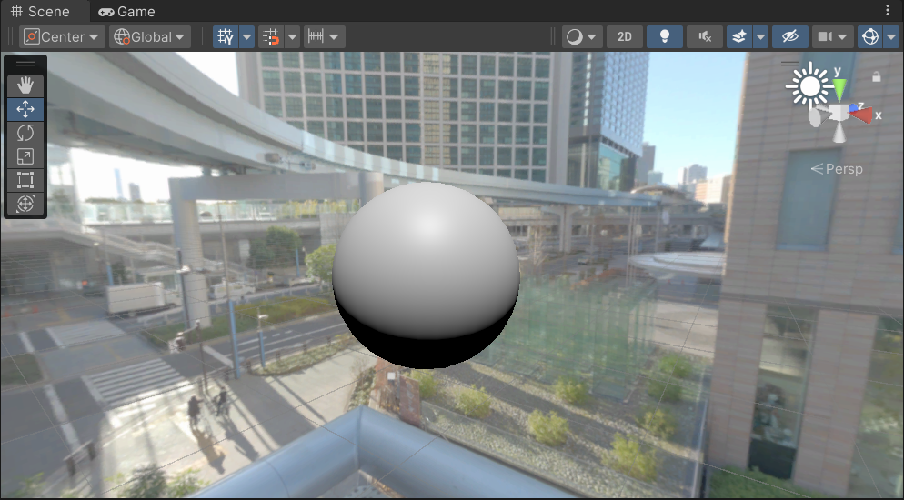
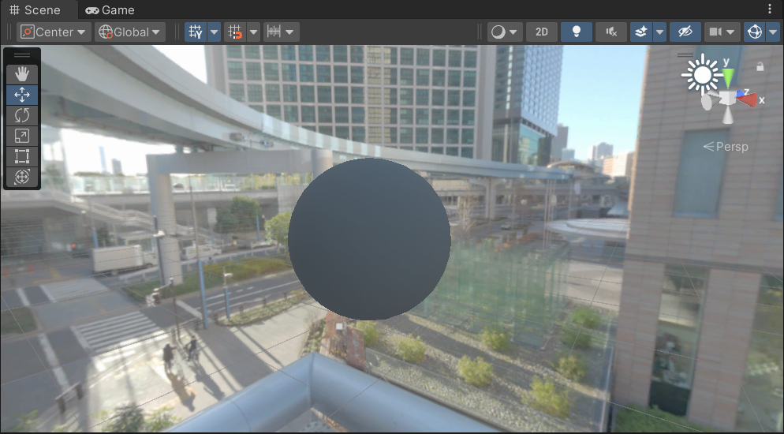
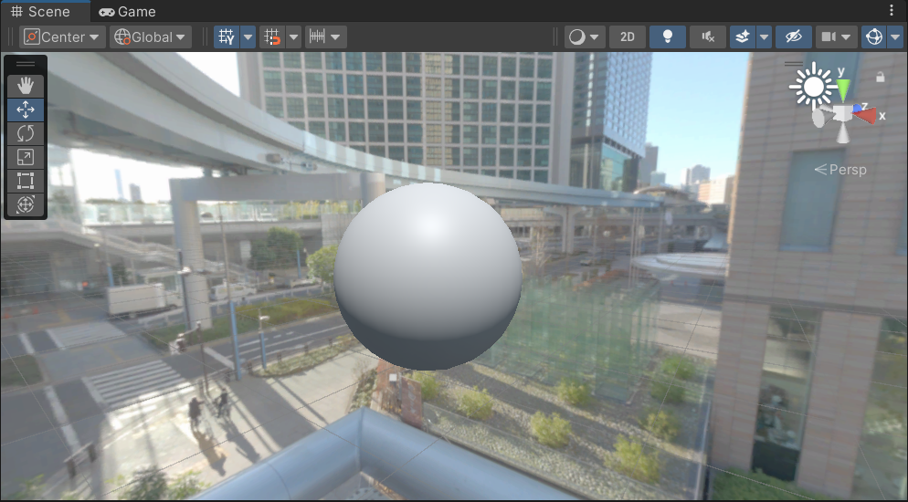

## Diffuse
### 原理
$$
\begin{align}
L_{o} &= \iint \limits_{H} \frac{albedo}{\pi}L_{i}(w_{i})\cos{\theta_{i}} \, \mathrm{d}w_{i} \\
      &= \frac{albedo}{\pi}\iint \limits_{H} L_{i}(w_{i})\cos{\theta_{i}} \, \mathrm{d}w_{i}
\end{align} 
$$
也就是 $EnvironmentDiffuse(\mathbf{p})=c_{d}Irradiance(\mathbf{p})$, $c_{d}=\frac{albedo}{\pi}$.

后面这部分积分（IrradianceMap）是可以预计算到贴图中，做 shading 的时候直接查询的.

### Irradiance Map Implementation in SRP
用 Compute Shader 计算 Irradiance Map (六个面).
```
for each face
	for each pixel
		direction = GetDirection(pixel, face)
		irradiance = EvaluateIntegral(direction)
```

对于 CubeMap 上的每一个像素点，要得到对应的世界坐标下的方向.
UVSpace -> WorldSpace


#Cubemap
注意轴方向和每个面的uv方向(左手系)
![[CubemapLeftHand.png|400]]


#### Cosine-Weighted Sampling
用 Monte Carlo 方法算积分，用 cosine 权重采样.
采样点需要算好之后传给 Compute Shader.
把 $\cos\theta_{i}$ 作为 $w_{i}$ 的 PDF（Probability Density Function） 的一部分，注意归一化: $\iint \limits_{H} \frac{1}{\pi}cos{\theta_{i}} \, \mathrm{d}w_{i} = 1$(半球上 $\cos\theta$ 的积分值是 pi).
所以
$$
PDF(w_{i}) = \frac{1}{\pi} cos{\theta_{i}}
$$
要算的积分写成
$$
\begin{align}
\iint \limits_{H} L_{i}(w_{i})\cos{\theta_{i}} \, \mathrm{d}w_{i} = \iint \limits_{H} \pi L_{i}(w_{i}) \frac{\cos{\theta_{i}}}{\pi} \, \mathrm{d}w_{i}
\end{align}
$$
被采样的随机变量为
$$
X = \pi L_{i}(w_{i})
$$
这个随机变量的均值即为估计的积分值.
##### Little Trick
把 $\frac{albedo}{\pi}$ 的 $1 / \pi$ 也算入积分内，则抵消掉系数 $\pi$，也就是只需要求 $L_{i}(w_{i})$ 的均值就好了.
最终的 environment diffuse term $= albedo \frac{1}{N}\sum\limits_{k=1}^{N}L_{i}(w_{k})$.
少个PI算出来的结果会暗很多.



##### Generate Cosine-Weighted Distribution


在 中心在$[0, 1, 0]$的单位球面上均一分布采样，然后把方向归一化，得到的就是 cosine-weighted 的方向.
用此方法，只需**先得到一堆均一分布的 UnitVector 传入 Compute Shader**，在 Shader 里与 Normal 相加再归一化，得到最终的采样方向.
#### Compute Shader
用 2D Array 类型的 RenderTexture 放计算结果，然后再 Copy 到 新创建的 CubeMap 里去.（没搞明白怎么直接写到 Cubemap 类型的RT。。）
![[ResultRT.png|300]]



##### IrradianceMapShader.compute
```C
#pragma kernel CSMain

#define FLT_MIN  1.175494351e-38
#define PI 3.14159265358979323846

RWTexture2DArray<float4> _Result; // Result irradiance map
TextureCube _Input; // input environment map
SamplerState sampler_LinearClamp;

float2 _TextureSizeInv; // to uv space [0, 1]^2

RWStructuredBuffer<float3> _UnitVectorSamples; // sample points

float3 SafeNormalize(float3 v)
{
    float l2 = max(FLT_MIN, dot(v, v));
    return v * rsqrt(l2);
}

float3 IndexToDirection(uint3 ind)
{
    float2 uv = (ind.xy + 0.5f) * _TextureSizeInv; // [0,1]
    uv *= 2.0f;
    uv -= 1.0f;
    
    float3 direction = float3(0.0f, 0.0f, 0.0f);
    
    switch (ind.z)
    {   // v axis flipped for building Cubemap
        case 0: 
            direction.x = 1.0f;
            direction.y = uv.y;
            direction.z = -uv.x;
            direction.y *= -1.0f;
            break;
        case 1: 
            direction.x = -1.0f;
            direction.zy = uv.xy;
            direction.y *= -1.0f;
            break;
        case 2:
            direction.y = 1.0f;
            direction.x = uv.x;
            direction.z = -uv.y;
            direction.z *= -1.0f;
            break;
        case 3:
            direction.y = -1.0f;
            direction.xz = uv.xy;
            direction.z *= -1.0f;
            break;
        case 4:
            direction.z = 1.0f;
            direction.xy = uv.xy;
            direction.y *= -1.0f;
            break;
        case 5:
            direction.z = -1.0f;
            direction.x = -uv.x;
            direction.y = uv.y;
            direction.y *= -1.0f;
            break;
    }
    
    return normalize(direction);
}

float3 SampleCubemap(TextureCube cubemap, float3 direction)
{
    return cubemap.SampleLevel(sampler_LinearClamp, direction, 0).rgb;
}

float3 CosineWeightedSample(float3 normal, int ind)
{
    return SafeNormalize(normal + _UnitVectorSamples[ind]);
}


float3 IntegrateIrradianceCosineWeighted(float3 normal)
{   
    uint size = 0;
    uint stride = 0;
    
    _UnitVectorSamples.GetDimensions(size, stride);
    
    float3 irradiance = 0.0f;
    
    for (uint i = 0; i < size; i++)
    {
        float3 direction = CosineWeightedSample(normal, i);
        irradiance += SampleCubemap(_Input, direction); // albedo's 1/pi included, X_i = pi * (1/pi) * L_i
    }

    return irradiance / (float)size;
}

float3 IntegrateIrradianceSum(float3 normal)
{
    float3 tangent = float3(0, 1, 0);
    float upOrDown = dot(normal, tangent);

    if (upOrDown == 1)
        tangent = float3(1, 0, 0);
    else if (upOrDown == -1)
        tangent = float3(-1, 0, 0);
    else
        tangent = normalize(cross(float3(0, 1, 0), normal));

    float3 binormal = normalize(cross(normal, tangent));
    
    float sampleDelta = 0.025;
    int N1 = 0;
    int N2 = 0;

    float3 irradiance = float3(0, 0, 0);

    for (float phi = 0.0; phi < 2.0 * PI; phi += sampleDelta)
    {
        N2 = 0;

        for (float theta = 0.0; theta < 0.5 * PI; theta += sampleDelta)
        {
            float3 tangentSpaceNormal = float3(sin(theta) * cos(phi), sin(theta) * sin(phi), cos(theta));
            float3 worldNormal = tangentSpaceNormal.x * tangent + tangentSpaceNormal.y * binormal + tangentSpaceNormal.z * normal;

            irradiance += SampleCubemap(_Input, worldNormal) * cos(theta) * sin(theta);

            N2++;
        }

        N1++;
    }

    float weight = PI * PI / (N1 * N2);
    irradiance *= weight;
    
    return irradiance;
}

[numthreads(8,8,1)]
void CSMain (uint3 dispatchThreadID : SV_DispatchThreadID)
{
    float3 direction = IndexToDirection(dispatchThreadID);
    
    //float3 irradiance = IntegrateIrradianceSum(direction);
    float3 irradiance = IntegrateIrradianceCosineWeighted(direction);
    
    _Result[dispatchThreadID.xyz] = float4(irradiance, 1.0f);

}

```
##### ComputeIrradianceMap.cs
```c#
using UnityEngine;
using UnityEditor;

public class ComputeIrradianceMap
{
    int _kernelId;

    static int _resultTexId = Shader.PropertyToID("_Result"),
        _inputTexId = Shader.PropertyToID("_Input"),
        _texSizeInvId = Shader.PropertyToID("_TextureSizeInv"),
        _samplesId = Shader.PropertyToID("_UnitVectorSamples");

    static int _sampleNum = 10000;

    public Cubemap envMap;
    public ComputeShader irradianceComputeShader;
    public RenderTexture resultRenderTexture;

    private ComputeBuffer unitVectorSampleBuffer;


    void SetUnitVectorSamples()
    {
        unitVectorSampleBuffer = new ComputeBuffer(_sampleNum, sizeof(float) * 3);
        Vector3[] samples = new Vector3[_sampleNum];

        Debug.Log($"sample num: {_sampleNum}");

        for (int i = 0; i < _sampleNum; i++)
        {
            samples[i] = CommonMath.RandomUnitVector();
        }

        unitVectorSampleBuffer.SetData(samples);

        irradianceComputeShader.SetBuffer(_kernelId, _samplesId, unitVectorSampleBuffer);
    }

    void SetupComputeShaderVariables()
    {
        _kernelId = irradianceComputeShader.FindKernel("CSMain");

        if (!resultRenderTexture.IsCreated())
            resultRenderTexture.Create();

        Debug.Log($"Cubemap size: {envMap.width} x {envMap.height}");
        Debug.Log($"RenderTexture size: {resultRenderTexture.width} x {resultRenderTexture.height}");


        irradianceComputeShader.SetTexture(_kernelId, _inputTexId, envMap);
        irradianceComputeShader.SetTexture(_kernelId, _resultTexId, resultRenderTexture);

        irradianceComputeShader.SetVector(_texSizeInvId, new Vector2(1f / resultRenderTexture.width, 1f / resultRenderTexture.height));

        SetUnitVectorSamples();
    }

    public void Setup(ComputeShader computeShader, Cubemap map, RenderTexture resultRt)
    {
        irradianceComputeShader = computeShader;
        envMap = map;
        resultRenderTexture = resultRt;
    }

    public void Evaluate()
    {
        SetupComputeShaderVariables();

        irradianceComputeShader.GetKernelThreadGroupSizes(_kernelId, out uint x, out uint y, out uint z);
        Debug.Log($"kernel group size: {x}, {y}, {z}");

        irradianceComputeShader.Dispatch(_kernelId, resultRenderTexture.width / (int)x, resultRenderTexture.height / (int)y, 6);

        Debug.Log($"Is rendertexture in SRGB space: {resultRenderTexture.isDataSRGB}");
        Debug.Log($"Rendertexture use SRGB conversion: {resultRenderTexture.sRGB}");
    }
}

```
##### Results
无环境光


只有 Environment Diffuse


DirectLight + EnvironmentDiffuse



## Reference
- [Real Shading in Unreal Engine 4](https://cdn2.unrealengine.com/Resources/files/2013SiggraphPresentationsNotes-26915738.pdf)
- https://zhuanlan.zhihu.com/p/463309766
- https://zznewclear13.github.io/posts/calculate-spherical-harmonics-using-compute-shader/#calculateharmonicscs