记录一下实现阴影系统过程中困惑的地方，支持了多光源 (up to 4) 的 Cascaded Shadow Map, TentFilter 和 PoissonFilter 的 PCF Shadow, 和 PCSS.

The implementation is based on [Catlike Tutorial: Directional-shadows](https://catlikecoding.com/unity/tutorials/custom-srp/directional-shadows/), which supports Cascaded Shadow with multiple lights, and PCF Shadow with Unity TentFilter.

Then add PCSS feature based on [Nvidia PCSS whitepaper](https://developer.download.nvidia.com/whitepapers/2008/PCSS_Integration.pdf).

<!-- For further analysis to **how to cope with shadow artifacts**, see [this post]. -->

## Preparation
Here's the basic parameters of the shadows.\
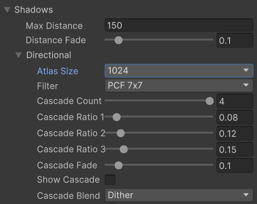
### Shadow Map and Split
First we need a RenderTexture to store the Shadow Map.
```c#
buffer.GetTemporaryRT(dirShadowAtlasId, atlasSize, atlasSize);
```

Because we need to support Cascaded and Multiple lights, we need to split the whole ShadowMap into multiple tiles, each tile is the shadow map of a cascaded split region of a light source.\
(每个 tile 是一个 cascaded 区域的 shadowmap)

And we define 3 split patterns, which follows this rule:
```c#
int tiles = _shadowedDirectionalLightCount * _settings._directional.cascadeCount;  
int split = tiles <= 1 ? 1 : tiles <= 4 ? 2 : 4;  
int tileSize = atlasSize / split;
```
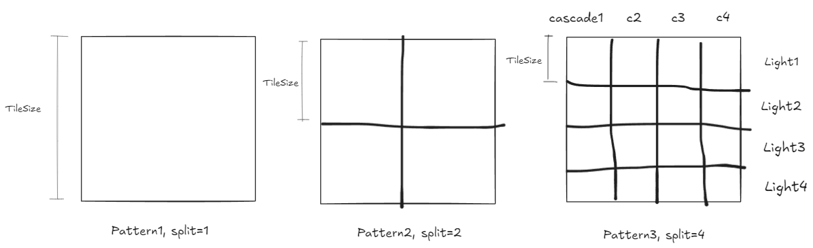

### Shadow Matrix
Unity provides [CullingResults.ComputeDirectionalShadowMatricesAndCullingPrimitives](https://docs.unity3d.com/2022.3/Documentation/ScriptReference/Rendering.CullingResults.ComputeDirectionalShadowMatricesAndCullingPrimitives.html) to compute the ShadowMatrix and the Sphere that bounds the cascade region. \
(Unity 是用 Sphere 来表示 cascade split，好处是判定 cascade 层级时简单，不知道这个 split 算法是怎么划分的)
```c#
// for each light that casts shadows
for (int i = 0; i < cascadeCount; i++)  
{  
    _cullingResults.ComputeDirectionalShadowMatricesAndCullingPrimitives(  
		light.visibleLightIndex, i, cascadeCount, ratios, tileSize, light.nearPlaneOffset,  
        out Matrix4x4 viewMatrix, out Matrix4x4 projectionMatrix,  
        out ShadowSplitData splitData  
    );
    ...
}
```

这个 Orthogonal Projection 的 Frustum 是沿着 DirectionalLight 的方向，根据 Camera 的 Frustum 加上阴影可见的 MaxDistance 做一个 bounding，所以 MaxDistance 会影响整个 ShadowMap 包含的场景大小.

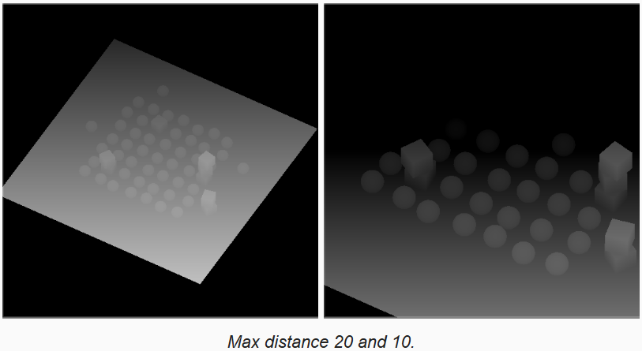

#### Add ViewPort Transformation
Because we split the whole shadow map into cascade tiles. We need to add a ViewPort Transformation to fit the tile position.

For writing into shadow map, simply set the viewport
```c
Vector2 SetTileViewPort(int index, int split, float tileSize)  
{  
    Vector2 offset = new Vector2(index % split, index / split);  
    _buffer.SetViewport(new Rect(  
        offset.x * tileSize, offset.y * tileSize, tileSize, tileSize));  
    return offset;  
}
```

While sampling shadow, we need a direct matrix to transform the WorldSpace Coordinate to the UV Coordinate, so we add a ViewPort Shift after the shadow projection.\
(The code below is equal to apply scaling and transposition)
```c
Matrix4x4 ConvertToAtlasMatrix(Matrix4x4 m, Vector2 offset, int split)  
{  
    if (SystemInfo.usesReversedZBuffer)  
    {        m.m20 = -m.m20;  
        m.m21 = -m.m21;  
        m.m22 = -m.m22;  
        m.m23 = -m.m23;  
    }    float scale = 1f / split;  
    m.m00 = (0.5f * (m.m00 + m.m30) + offset.x * m.m30) * scale;  
    m.m01 = (0.5f * (m.m01 + m.m31) + offset.x * m.m31) * scale;  
    m.m02 = (0.5f * (m.m02 + m.m32) + offset.x * m.m32) * scale;  
    m.m03 = (0.5f * (m.m03 + m.m33) + offset.x * m.m33) * scale;  
    m.m10 = (0.5f * (m.m10 + m.m30) + offset.y * m.m30) * scale;  
    m.m11 = (0.5f * (m.m11 + m.m31) + offset.y * m.m31) * scale;  
    m.m12 = (0.5f * (m.m12 + m.m32) + offset.y * m.m32) * scale;  
    m.m13 = (0.5f * (m.m13 + m.m33) + offset.y * m.m33) * scale;  
    m.m20 = 0.5f * (m.m20 + m.m30);  
    m.m21 = 0.5f * (m.m21 + m.m31);  
    m.m22 = 0.5f * (m.m22 + m.m32);  
    m.m23 = 0.5f * (m.m23 + m.m33);  
    return m;  
}
```

## Sampling Shadow
### Sampling Cascade
Use the culling sphere to evalute which cascade current fragment is in.
```c
	int i;
	for (i = 0; i < _CascadeCount; i++) {
		float4 sphere = _CascadeCullingSpheres[i];
		float distanceSqr = DistanceSquared(surfaceWS.position, sphere.xyz);
		if (distanceSqr < sphere.w) {
			break;
		}
	}
	data.cascadeIndex = i;
```

#### Fade Function
We only want to fade out at the last bit of the distance, so the fade out funtion is like this:
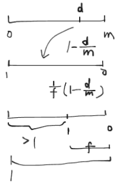
```c
// fade is 1/f, scale is 1/m
float FadedShadowStrength(float distance, float scale, float fade)  
{  
    return saturate((1.0 - distance * scale) * fade);  
}
```

We use this fade out function in the **Max Distanc**e fade out and **Blend between Two Cascades**.

#### Max Distance
Note that, according to the catlike tutorial: "Some experimentation with the max shadow distance will reveal that some shadow casters suddenly disappear while still inside the culling sphere of the last cascade. This happens because **the outermost culling sphere** doesn't end exactly at the configured max distance but **extends a bit beyond it**. This discrepancy is most noticeable with a small max distance."\
This means that if the fragment is in the last cascade, we need to get its **world depth against the view camera**, and compare it with the **max distance**.
```c
ShadowData data;  
data.strength = FadedShadowStrength(surfaceWS.depth, _ShadowDistanceFade.x, _ShadowDistanceFade.y);
```

#### Blend between Cascaded
First of all, because we want to blend between two adjacent cascades to make the transition smoother, **the two adjacent cascades must be a bit of overlapped**.\
Unity gives [**ShadowSplitData.shadowCascadeBlendCullingFactor**](https://docs.unity3d.com/2022.3/Documentation/ScriptReference/Rendering.ShadowSplitData-shadowCascadeBlendCullingFactor.html) to control the culling sphere radius, substract from the fade scale and a bit more to make sure there's overlap.
```c
float cullingFactor =
			Mathf.Max(0f, 0.8f - settings.directional.cascadeFade);
		
for (int i = 0; i < cascadeCount; i++) {
	…
	splitData.shadowCascadeBlendCullingFactor = cullingFactor;
	…
}
```

While blending, since we use the **squared distance** to determine the cascade level, we express fade **in terms of squared distance** as well:
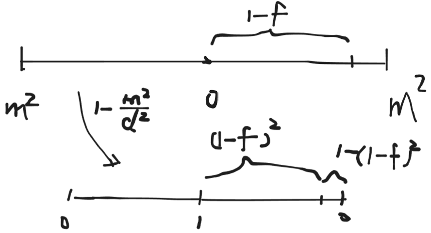
```c
//** in C# script
float f = 1 - _settings._directional.cascadeFade;  
_buffer.SetGlobalVector(_shadowDistanceFadeId,   
new Vector4(1f / _settings.maxDistance, 1f / _settings.distanceFade,  
        1f / (1f - f * f))); // to use mult instead of division in GPU
        
// ------------------------

//** in shadow hlsl
float fade = FadedShadowStrength(  
    distanceSqr, _CascadeData[i].x, _ShadowDistanceFade.z);

```

#### Blend Methods

##### Sample Two Cascade Map
One way it to simply sample two adjacent cascaded shadow maps and blend the shadow intensity between using the fade factor.
```c
shadow = lerp(shadowCurrentCascade, shadowNextCascade, global.cascadeBlend);
```
This **doubles the sample** times.
##### Using a Dithered Pattern
Basically we generate a dithered noise using the fragment's Clip Space coordinate, and then use it **as a shreshold to determine which cascade map to use**.
```c
surface.dither = InterleavedGradientNoise(input.positionCS.**xy**, 0);
```

```c
#if defined(_CASCADE_BLEND_DITHER)
	else if (data.cascadeBlend < surfaceWS.dither) {
		i += 1;
	}
#endif
```

The dithered method can be use in combination with temporal anti-aliasing and an animated dither pattern, to decrease the dithered artifact.

### PCF
Different **filter type**s** make a big difference to the PCF effect. See [my analysis here](https://github.com/faw121/PCF_PCSS_Shadow).\
Unity provides a **Tent Filter**, which is cheap and produces pretty good looking shadows.
#### Tent Filter
See example in one dimension, the **Linear interpolation** can be seen as **using Tent Filter doing descrete convolution** (only add up points)
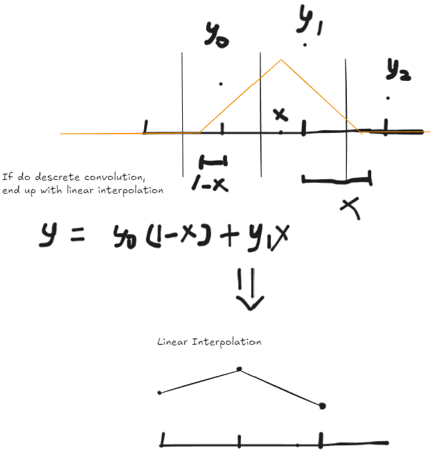

The **derivative** of this curve created by linear interpolation is **not continuous**, we want to make it continuous.

In `com.unity.render-pipelines.core/ShaderLibrary/Shadow/ShadowSamplingTent.hlsl`, Unity provides apis for Tent Filter Sampling.
```c
// 3x3 Tent filter (45 degree sloped triangles in U and V)
void SampleShadow_ComputeSamples_Tent_3x3(real4 shadowMapTexture_TexelSize, real2 coord, out real fetchesWeights[4], out real2 fetchesUV[4])
{
    // tent base is 3x3 base thus covering from 9 to 12 texels, thus we need 4 bilinear PCF fetches
    real2 tentCenterInTexelSpace = coord.xy * shadowMapTexture_TexelSize.zw;
    real2 centerOfFetchesInTexelSpace = floor(tentCenterInTexelSpace + 0.5);
    real2 offsetFromTentCenterToCenterOfFetches = tentCenterInTexelSpace - centerOfFetchesInTexelSpace;

    // find the weight of each texel based
    real4 texelsWeightsU, texelsWeightsV;
    SampleShadow_GetTexelWeights_Tent_3x3(offsetFromTentCenterToCenterOfFetches.x, texelsWeightsU);
    SampleShadow_GetTexelWeights_Tent_3x3(offsetFromTentCenterToCenterOfFetches.y, texelsWeightsV);

    // each fetch will cover a group of 2x2 texels, the weight of each group is the sum of the weights of the texels
    real2 fetchesWeightsU = texelsWeightsU.xz + texelsWeightsU.yw;
    real2 fetchesWeightsV = texelsWeightsV.xz + texelsWeightsV.yw;

    // move the PCF bilinear fetches to respect texels weights
    real2 fetchesOffsetsU = texelsWeightsU.yw / fetchesWeightsU.xy + real2(-1.5,0.5);
    real2 fetchesOffsetsV = texelsWeightsV.yw / fetchesWeightsV.xy + real2(-1.5,0.5);
    fetchesOffsetsU *= shadowMapTexture_TexelSize.xx;
    fetchesOffsetsV *= shadowMapTexture_TexelSize.yy;

    real2 bilinearFetchOrigin = centerOfFetchesInTexelSpace * shadowMapTexture_TexelSize.xy;
    fetchesUV[0] = bilinearFetchOrigin + real2(fetchesOffsetsU.x, fetchesOffsetsV.x);
    fetchesUV[1] = bilinearFetchOrigin + real2(fetchesOffsetsU.y, fetchesOffsetsV.x);
    fetchesUV[2] = bilinearFetchOrigin + real2(fetchesOffsetsU.x, fetchesOffsetsV.y);
    fetchesUV[3] = bilinearFetchOrigin + real2(fetchesOffsetsU.y, fetchesOffsetsV.y);

	// total weights add up to 1
	// (fetchesWeightsU.x + fetchesWeightsU.y)(fetchesWeightsV.x + fetchesWeightsV.y)
    fetchesWeights[0] = fetchesWeightsU.x * fetchesWeightsV.x;
    fetchesWeights[1] = fetchesWeightsU.y * fetchesWeightsV.x;
    fetchesWeights[2] = fetchesWeightsU.x * fetchesWeightsV.y;
    fetchesWeights[3] = fetchesWeightsU.y * fetchesWeightsV.y;
}
```


1D Example\
It takes the **pixel area covered by the tent filter** as weight, **use these weights to produce two sample points with corresponding weights**, and then add up the sampled values with the weights.
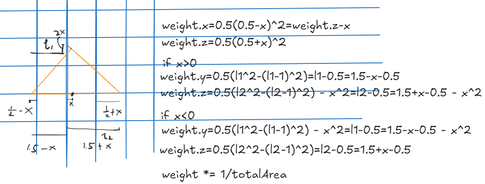

2D Example\
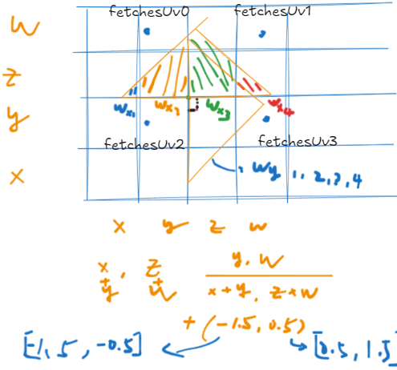

Sampling Shadow
```c
float FilterDirectionalShadow(float3 positionSTS)
{
	float weights[DIRECTIONAL_FILTER_SAMPLES];
	float2 positions[DIRECTIONAL_FILTER_SAMPLES];
	float4 size = _ShadowAtlasSize.yyxx;
	DIRECTIONAL_FILTER_SETUP(size, positionSTS.xy, weights, positions);
	float shadow = 0;
	for (int i = 0; i < DIRECTIONAL_FILTER_SAMPLES; i++)
	{
		shadow += weights[i] * SampleDirectionalShadowAtlas(
			float3(positions[i].xy, positionSTS.z)
		);
	}
	return shadow;
}
```
##### Compare to Poisson PCF
This Tent Filter **introduces less noise, and is much cheaper** (only sample 4 times, since bilinear sampling is done by hardware) than Poisson Filter.

Tent7x7\
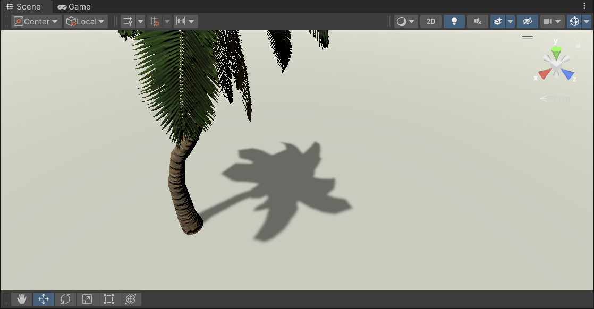

Poisson Filter with 16 sample points per fragment.\
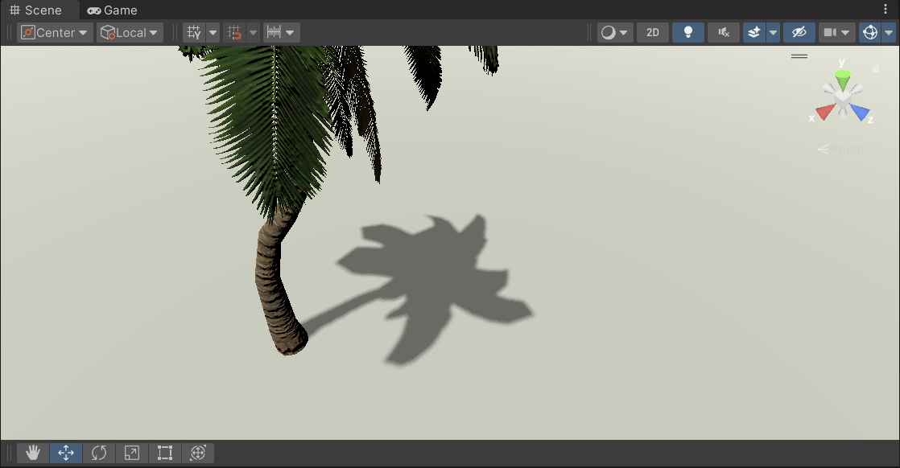

### PCSS
Let's have a look at the PCSS formular:
$$
w_{penumbra}=\frac{d_{near}(d_{receiver}-d_{blocker})w_{light}}{d_{blocker}d_{receiver}w_{frustum}}
$$
$$
w_{search}=\frac{(d_{receiver}-d_{near})w_{light}}{d_{receiver}w_{frustum}}
$$
Consider ${w_{light}} / {w_{frustum}}$ as a scaling factor, to make it adjustable via the panel, make it **two seperate scaling factors** for block search and penumbra radius. So the formular becomes like this:
$$
w_{penumbra}=\frac{d_{near}s_{penumbra}(d_{receiver}-d_{blocker})}{d_{blocker}d_{receiver}}
$$
$$
w_{search}=\frac{s_{search}(d_{receiver}-d_{near})}{d_{receiver}}
$$
From the control panel it's like this:

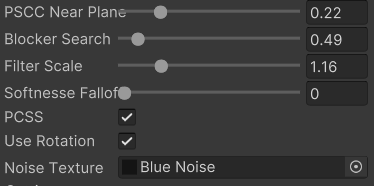

#### PCSS Sampling
Use Poisson filter, with 16 samples per fragment
```c
#define NUM_SAMPLE 16  
  
static const float2 poissonDisk[16] =  
{  
    float2(-0.94201624, -0.39906216),  
    float2(0.94558609, -0.76890725),  
    float2(-0.094184101, -0.92938870),  
    float2(0.34495938, 0.29387760),  
    float2(-0.91588581, 0.45771432),  
    float2(-0.81544232, -0.87912464),  
    float2(-0.38277543, 0.27676845),  
    float2(0.97484398, 0.75648379),  
    float2(0.44323325, -0.97511554),  
    float2(0.53742981, -0.47373420),  
    float2(-0.26496911, -0.41893023),  
    float2(0.79197514, 0.19090188),  
    float2(-0.24188840, 0.99706507),  
    float2(-0.81409955, 0.91437590),  
    float2(0.19984126, 0.78641367),  
    float2(0.14383161, -0.14100790)  
};
```

Because all the sample points are static, it produces this edge pattern, looking like many outlines add up \
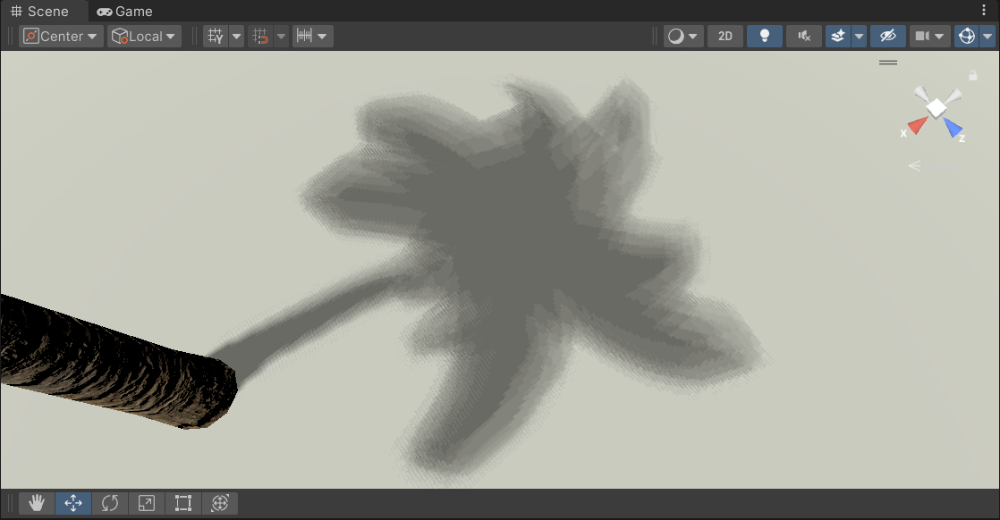

We can introduce **a random rotaion of the poisson disk** every sample time. The noise comes from a blue noise texture, and is sampled with the fragment's clip space uv.
```c
#if defined(_USE_ROTATION)  
    float rotationAngle = surfaceWS.noise * 3.1415926;  
    rotationTrig = float2(cos(rotationAngle), sin(rotationAngle));#endif
```

With the rotation, the shadow looks less horrible, though noiser.\


## Transparency
Two ways to produce shadow map
- "real" shadows, by clipping the fragment with a **Cutoff** value
- "fake" shadows, by clipping against a **Dithered Noise**

In ShadowCasterPass
```c
#if defined(_SHADOWS_CLIP)
	clip(base.a - UNITY_ACCESS_INSTANCED_PROP(UnityPerMaterial, _Cutoff));
#elif defined(_SHADOWS_DITHER)  
       float dither = InterleavedGradientNoise(input.positionCS.xy, 0);  
       clip(base.a - dither);
#endif
```

Disadvantages for dithered shadows:
- **Trembling** from temporal artifacts when the shadow matrix changes(simply camera/object moves)
- Overlapped shadows don't appear darker
