Most problems caused by using **Shadow Map** to generate shadows are due to **the mismatch of shadow map resolution and screen resolution**.

## Shadow Acne
Shadow acne apperas on surface shed by light, if the surface's **normal isn't parallel to the light direction**.
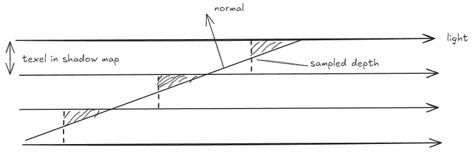

Shadow Acne with large incoming light angle.\
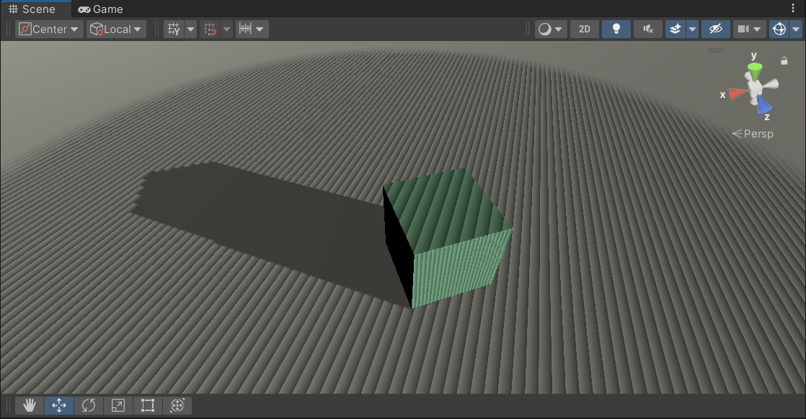

Shadow Acne with small incoming light angle.\
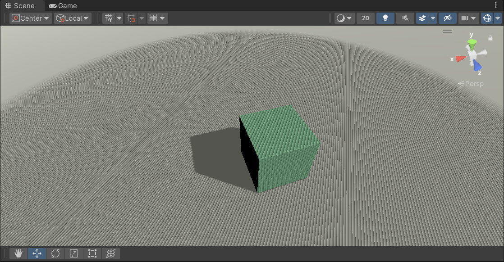

### Depth bias
If we **shift the surface along the light direction towards the light**, so that **every point covered by the shadow map texel has a depth >= that on the shadow map**.\
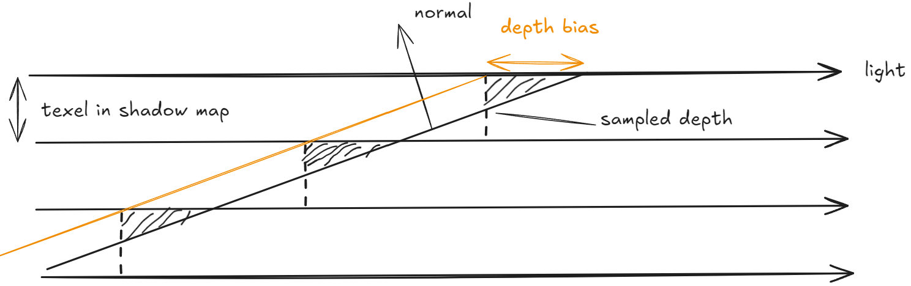
So the simplest method is to make the depth bias a **constant value**.
### Peter-Panning
If the shifted receiver plane moves ahaed of any shadow caster, it will act as if there's no caster in front of this part of plane.\
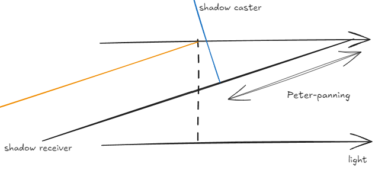

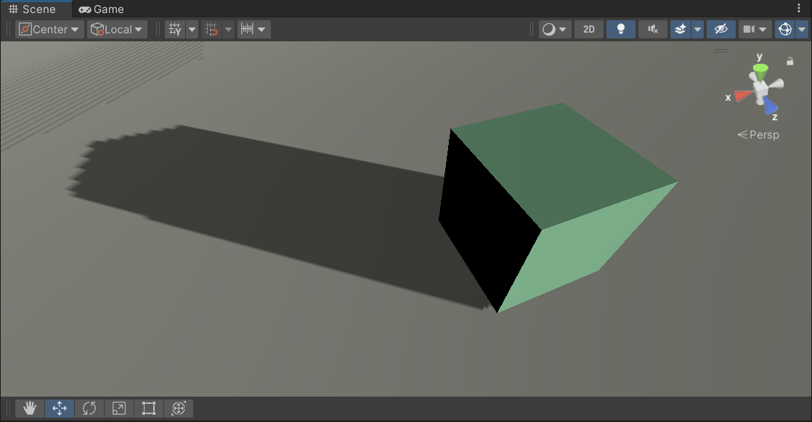


### Slope Bias
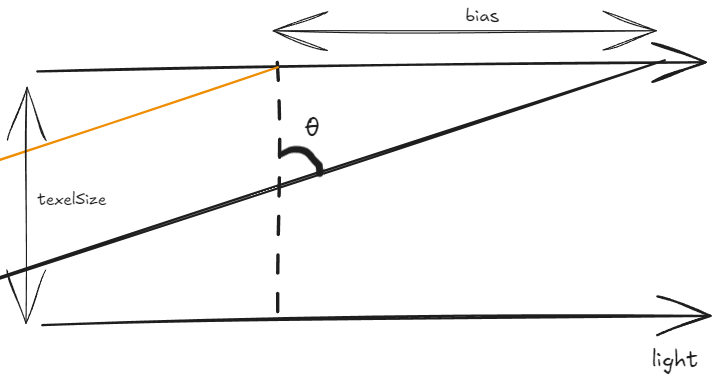
The needed shift value along the light direction is
$$
bias=0.5TexelSize\tan\theta
$$
The slope bias is proportional to the absolute clip-space depth derivative along the X and Y dimensions.
$$
slopeBias = slopeScaleBias×∣∇z∣
$$
So we have a depth bias that adjusts itself according to the incoming light angle.

However, slope bias still d**oesn't eliminate the problem of Peter-panning**, since the bias gets super large when the incoming light angle approaches 90 degree, so there's a large gap between the shifted surface and the original surface.
### Normal Bias
The basic idea of normal bias is that, you move the surface **along the surface normal** instead of along the light direction, **so that the bias becomes bounded**.\
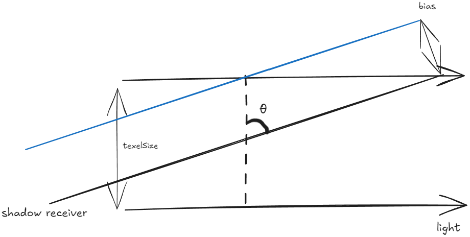
Analyze in this simple geometry, the normal bias is
$$
normalBias = 0.5\sqrt{ 2 }worldTexelSize\sin\theta
$$
which is bounded because of the sin term.

There's a very clear [video explanation](https://web.archive.org/web/20160602213857/https://www.dissidentlogic.com/old/video/Techniques/NormalOffsetShadows_0001.wmv) that explains **why normal bias eliminates Peter-panning**.\
Move along light direction

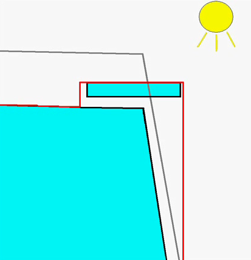
Move along normal\
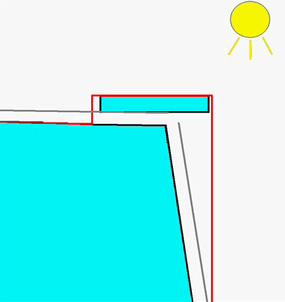
#### Some Implementation Detail
Because we shift along the normal, this need to be done **in world space**. 

And when we do normal bias **with PCF**, we **compare the sample point depth against all points in the filter area**, so use **filter size** rather than texel size, also in terms of world space.

The texel size in world space is evaluated from dividing the bounding volume size of the cascade by the shadow map tile size.\
For example if the bounding volume is a sphere, then
```c
float texelSize = 2f * cullingSphere.radius / tileSize
```

### Put It Toghter
With **only normal bias**, it's hard to eliminate this effect where shadows come out of the edge of contact\
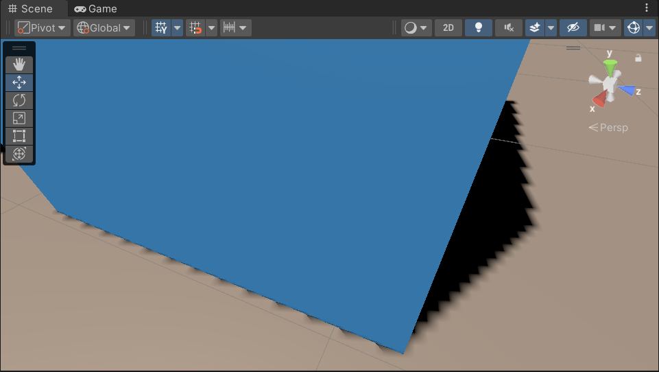\
This because of the limited resolution of shadow map. The outside and inside part of the contact edge share the same texel in the shadow map. And by **shifting along the normal, you can't reallly make the blocker go away** because they contact so firmly.\
But this can be done easily with a z coordinate depth shift.

By combine the slope bias and normal bias together, we get a rather clean shadow.\
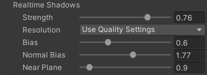\
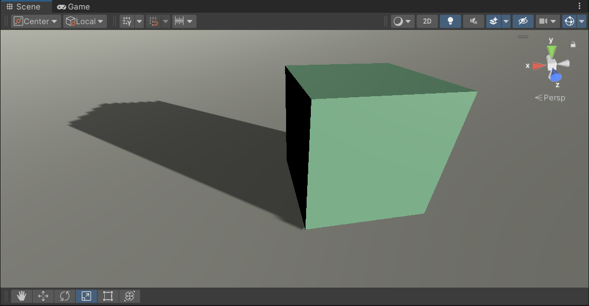


先占个坑剩下的晚点更。。
## Shadow Pancaking


## Floating point presicion
## Reference
- [Unity: ShadowOverview](https://docs.unity3d.com/550/Documentation/Manual/ShadowOverview.html)
- [gdc 2011 normal offset](https://user-images.githubusercontent.com/7088062/36948961-df37690e-1fea-11e8-8999-af8af60403fb.png)
- [An video explanation of Normal Offset Shadows](https://web.archive.org/web/20160602213857/https://www.dissidentlogic.com/old/video/Techniques/NormalOffsetShadows_0001.wmv)
