Shader code from [Real Shading in Unreal Engine 4](https://cdn2.unrealengine.com/Resources/files/2013SiggraphPresentationsNotes-26915738.pdf).\
reference [LearnOpenGL Specular-IBL](https://learnopengl.com/PBR/IBL/Specular-IBL)
## Prefilter Environment Map
### Render Texture Setup
Because Unity does not support compute shader writing to Cubemap RT, use **2D Array** instead.

With **mip map** and **random write** enabled, and **Trilinear** filter mode.

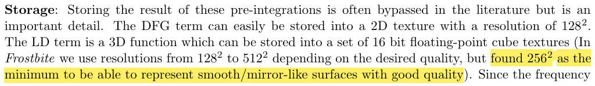
According to [moving_frostbite_to_pbr](https://seblagarde.wordpress.com/wp-content/uploads/2015/07/course_notes_moving_frostbite_to_pbr_v32.pdf), we use 256x256 resolution for the prefiltered map.

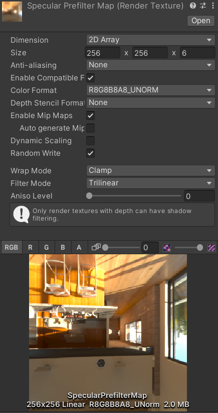

### Mip-Roughness
I use 6 mip map levels, and for the Mip-Roughness function, I just simply use the linear one.
```c#
float MipToRoughnessLinear(int mip)
{
    return (float)mip / (maxMipLevels - 1); // maxMipLevels = 6
}

float RoughnessToMipLinear(float roughness)
{
    return roughness * _MipCount; // _MipCount = 5
}
```


### Artifacts
[LearnOpenGL Specular-IBL](https://learnopengl.com/PBR/IBL/Specular-IBL) mentioned two artifacts with prefiltered specular map.

#### Cubemap seams at high roughness
As roughness gets larger, seals may appear at the cubemap face edges.

But I don't really see this artifact in my implementation. Just in case, call [Cubemap.SmoothEdges](https://docs.unity3d.com/2022.3/Documentation/ScriptReference/Cubemap.SmoothEdges.html).


#### Bright dots
Due to **sampling noises**, bright dots occur as roughness gets larger.

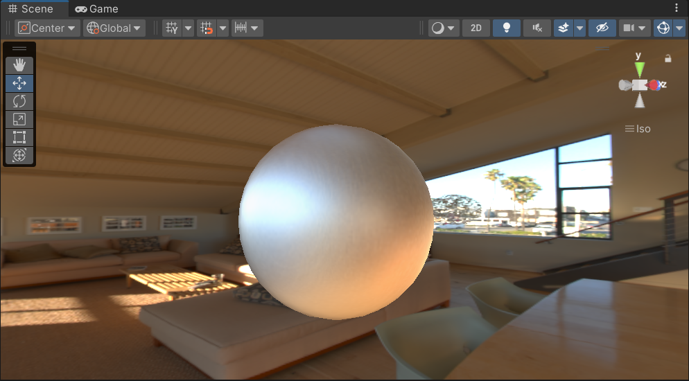

[LearnOpenGL Specular-IBL](https://learnopengl.com/PBR/IBL/Specular-IBL) gives the **Mipmap Filtered Samples** technique, which is furthered explained in [GPUGems3](https://developer.nvidia.com/gpugems/gpugems3/part-iii-rendering/chapter-20-gpu-based-importance-sampling).

The basic idea is: the lower the **PDF**, the more pixels of the environment should be averaged for that sample; the larger the **sample number**, the less pixels need to be averaged for that sample direction. And we **take the averaged value from the mip map of the environment map**.

Assume the solid angle we need to average around the sample direction is
$$
\Omega_{s} = \frac{1}{N \cdot pdf}
$$
We need to know how much area it covers in the 0 level specular map.\
Approximate the solid angle that **one pixel in level 0 texture covers** by
$$
\Omega_{p} = \frac{4\pi}{w^{2} \cdot 6}
$$
$w$ is the width of level 0 texture.\
So $\Omega_{p} / \Omega_{p}$ is how many times the area we need to average around is bigger than one pixel in level 0 texture. Take the square root of it, then take the log2 of it, then we get the mip level we want.
```c
float SampleLevel(float PDF, float SampleCount, float Roughness)
{
    float saTexel = 4.0 * PI / (6.0 * _WidthL0 * _WidthL0);
    float saSample = 1.0 / (SampleCount * PDF + 0.0001);
    return Roughness == 0.0 ? 0.0 : 0.5 * log2(saSample / saTexel);
}
```

However, the artifacts get lighter, but doesn't go away.\
(Need to fix it later...)
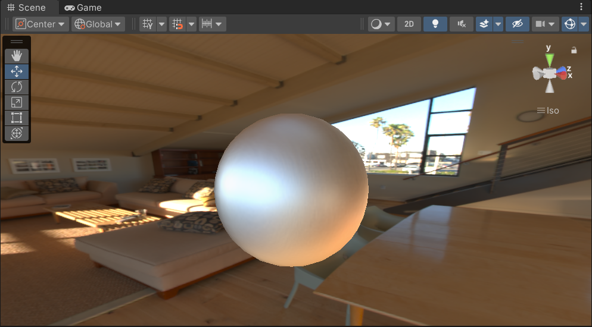


### Code
Here's the compute shader code.\
Hammersley2d sampling code is from Unity built-in shader library.
```c
#pragma kernel CSMain

#define PI 3.14159265358979323846
#define INV_PI 0.31830988618f

RWTexture2DArray<float4> _Result;
TextureCube _Input;
SamplerState sampler_TrilinearClamp;
SamplerState sampler_LinearClamp;

float2 _TextureSizeInv;
float _Roughness;
float _WidthL0;


float3 IndexToDirection(uint3 ind)
{
    float2 uv = (ind.xy + 0.5f) * _TextureSizeInv; // [0,1]
    uv *= 2.0f;
    uv -= 1.0f;
    
    float3 direction = float3(0.0f, 0.0f, 0.0f);
    
    switch (ind.z)
    {   // v axis flipped for building Cubemap
        case 0: 
            direction.x = 1.0f;
            direction.y = uv.y;
            direction.z = -uv.x;
            direction.y *= -1.0f;
            break;
        case 1: 
            direction.x = -1.0f;
            direction.zy = uv.xy;
            direction.y *= -1.0f;
            break;
        case 2:
            direction.y = 1.0f;
            direction.x = uv.x;
            direction.z = -uv.y;
            direction.z *= -1.0f;
            break;
        case 3:
            direction.y = -1.0f;
            direction.xz = uv.xy;
            direction.z *= -1.0f;
            break;
        case 4:
            direction.z = 1.0f;
            direction.xy = uv.xy;
            direction.y *= -1.0f;
            break;
        case 5:
            direction.z = -1.0f;
            direction.x = -uv.x;
            direction.y = uv.y;
            direction.y *= -1.0f;
            break;
    }
    
    return normalize(direction);
}

float3 SampleCubemap(TextureCube cubemap, float3 direction, float level)
{
    return cubemap.SampleLevel(sampler_TrilinearClamp, direction, level).rgb;
}

//-----------------------------------------------------------------------------
// Hammersley
//-----------------------------------------------------------------------------
uint ReverseBits32(uint bits)
{
#if 0 // Shader model 5
    return reversebits(bits);
#else
    bits = (bits << 16) | (bits >> 16);
    bits = ((bits & 0x00ff00ff) << 8) | ((bits & 0xff00ff00) >> 8);
    bits = ((bits & 0x0f0f0f0f) << 4) | ((bits & 0xf0f0f0f0) >> 4);
    bits = ((bits & 0x33333333) << 2) | ((bits & 0xcccccccc) >> 2);
    bits = ((bits & 0x55555555) << 1) | ((bits & 0xaaaaaaaa) >> 1);
    return bits;
#endif
}

//-----------------------------------------------------------------------------
float RadicalInverse_VdC(uint bits)
{
    return float(ReverseBits32(bits)) * 2.3283064365386963e-10; // 0x100000000
}

//-----------------------------------------------------------------------------
float2 Hammersley2d(uint i, uint maxSampleCount)
{
    return float2(float(i) / float(maxSampleCount), RadicalInverse_VdC(i));
}

//-----------------------------------------------------------------------------
// ImportanceSampleGGX, from https://cdn2.unrealengine.com/Resources/files/2013SiggraphPresentationsNotes-26915738.pdf
//-----------------------------------------------------------------------------
float3 ImportanceSampleGGX(float2 Xi, float Roughness, float3 N)
{
    float a = Roughness * Roughness;
    
    float Phi = 2 * PI * Xi.x;
    float CosTheta = sqrt((1 - Xi.y) / (1 + (a * a - 1) * Xi.y));
    float SinTheta = sqrt(1 - CosTheta * CosTheta);
    
    float3 H;
    H.x = SinTheta * cos(Phi);
    H.y = SinTheta * sin(Phi);
    H.z = CosTheta;
    
    float3 UpVector = abs(N.z) < 0.999 ? float3(0, 0, 1) : float3(1, 0, 0);
    float3 TangentX = normalize(cross(UpVector, N));
    float3 TangentY = cross(N, TangentX);
    
    return TangentX * H.x + TangentY * H.y + N * H.z;
}

float GGX(float NoH, float roughness)
{
    float a = roughness * roughness;
    float a2 = a * a;
    float NoH2 = NoH * NoH;
    float d2 = NoH2 * (a2 - 1.0f) + 1.0f;
    d2 *= d2;
    return INV_PI * a2 / d2;
}

float PDFGGX(float D, float NoH, float HoV)
{
    return (D * NoH / (4.0 * HoV)) + 0.0001;

}

float SampleLevel(float PDF, float SampleCount, float Roughness)
{
    float saTexel = 4.0 * PI / (6.0 * _WidthL0 * _WidthL0);
    float saSample = 1.0 / (SampleCount * PDF + 0.0001);
    return Roughness == 0.0 ? 0.0 : 0.5 * log2(saSample / saTexel);
}


float3 PrefilterEnvMap(float Roughness, float3 R)
{
    float3 N = R;
    float3 V = R;
    
    float3 prefilteredColor = 0;
    
    const uint numSamples = 1024;
    float totalWeight = 0;
    for (uint i = 0; i < numSamples; i++)
    {
        float2 Xi = Hammersley2d(i, numSamples);
        float3 H = ImportanceSampleGGX(Xi, Roughness, N);
        float3 L = 2 * dot(V, H) * H - V;
        
        float NoL = saturate(dot(N, L));
        if (NoL > 0)
        {
            // denoising
            float NoH = dot(N, H);
            float HoV = dot(V, H);
            float D = GGX(NoH, Roughness);
            float pdf = PDFGGX(D, NoH, HoV);
            
            float mip = SampleLevel(pdf, numSamples, Roughness);
            
            prefilteredColor += SampleCubemap(_Input, L, mip).rgb * NoL; // cosine weighted achieves better results
            totalWeight += NoL;
        }
    }
    
    return prefilteredColor / totalWeight;
}

[numthreads(8,8,1)]
void CSMain (uint3 dispatchThreadID : SV_DispatchThreadID)
{
    float3 direction = IndexToDirection(dispatchThreadID);

    float3 irradiance = 0;
    
    irradiance = PrefilterEnvMap(_Roughness, direction);
    
    _Result[dispatchThreadID.xyz] = float4(irradiance, 1.0f);
}

```


## BRDF LUT
Use Compute Shader to precompute BRDF LUT.

Shader Input
- Inverse of texture resolution (pixel space to uv space)
- Result RT

Remeber to add 0.5 to convert to UV Space! (Otherwise will divide by 0)

512x512 RenderTexture using R16G16_UNORM format\
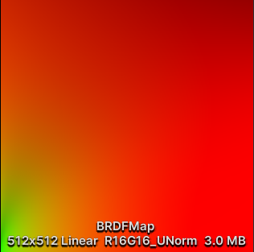

Because unity display **linear space** texture with **gamma correction** (^-2.2), it looks brighter.\
(at first I thought there was something wrong)

If we switch to sRGB format, then it looks like the normal BRDF LUT we are familiar with\
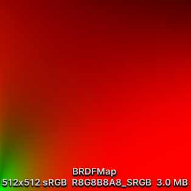
### Code
```c
#pragma kernel CSMain

#define PI 3.14159265358979323846


RWTexture2D<float4> _Result;
float2 _TextureSizeInv;

//-----------------------------------------------------------------------------
// Hammersley
//-----------------------------------------------------------------------------
uint ReverseBits32(uint bits)
{
#if 0 // Shader model 5
    return reversebits(bits);
#else
    bits = (bits << 16) | (bits >> 16);
    bits = ((bits & 0x00ff00ff) << 8) | ((bits & 0xff00ff00) >> 8);
    bits = ((bits & 0x0f0f0f0f) << 4) | ((bits & 0xf0f0f0f0) >> 4);
    bits = ((bits & 0x33333333) << 2) | ((bits & 0xcccccccc) >> 2);
    bits = ((bits & 0x55555555) << 1) | ((bits & 0xaaaaaaaa) >> 1);
    return bits;
#endif
}

//-----------------------------------------------------------------------------
float RadicalInverse_VdC(uint bits)
{
    return float(ReverseBits32(bits)) * 2.3283064365386963e-10; // 0x100000000
}

//-----------------------------------------------------------------------------
float2 Hammersley2d(uint i, uint maxSampleCount)
{
    return float2(float(i) / float(maxSampleCount), RadicalInverse_VdC(i));
}

//-----------------------------------------------------------------------------
// ImportanceSampleGGX, from https://cdn2.unrealengine.com/Resources/files/2013SiggraphPresentationsNotes-26915738.pdf
//-----------------------------------------------------------------------------
float3 ImportanceSampleGGX(float2 Xi, float Roughness, float3 N)
{
    float a = Roughness * Roughness;
    
    float Phi = 2 * PI * Xi.x;
    float CosTheta = sqrt((1 - Xi.y) / (1 + (a * a - 1) * Xi.y));
    float SinTheta = sqrt(1 - CosTheta * CosTheta);
    
    float3 H;
    H.x = SinTheta * cos(Phi);
    H.y = SinTheta * sin(Phi);
    H.z = CosTheta;
    
    float3 Upfloattor = abs(N.z) < 0.999 ? float3(0, 0, 1) : float3(1, 0, 0);
    float3 TangentX = normalize(cross(Upfloattor, N));
    float3 TangentY = cross(N, TangentX);
    
    return TangentX * H.x + TangentY * H.y + N * H.z;
}

float G_Smith(float Roughness, float NoV, float NoL)
{
    float k = 0.5 * Roughness * Roughness;
    float G1v = NoV / ((1 - k) * NoV + k);
    float G1l = NoL / ((1 - k) * NoL + k);
    
    return G1v * G1l;
}

float2 IntegrateBRDF(float Roughness, float NoV)
{
    float3 V;
    V.x = sqrt(1.0 - NoV * NoV); // sin(theta)
    V.y = 0;
    V.z = NoV; // cos(theta)
    
    float3 N = float3(0, 0, 1);
    
    float A = 0;
    float B = 0;
    
    const uint numSamples = 1024;
    for (uint i = 0; i < numSamples; i++)
    {
        float2 Xi = Hammersley2d(i, numSamples);
        float3 H = ImportanceSampleGGX(Xi, Roughness, N);
        float3 L = 2 * dot(V, H) * H - V;
        
        float NoL = saturate(L.z);
        float NoH = saturate(H.z);
        float VoH = saturate(dot(V, H));
        
        if (NoL > 0)
        {
            float G = G_Smith(Roughness, NoV, NoL);
            
            float G_Vis = G * VoH / (NoH * NoV);
            float Fc = pow(1 - VoH, 5);
            A += (1 - Fc) * G_Vis;
            B += Fc * G_Vis;
        }
    }

    return float2(A, B) / numSamples;
}

[numthreads(8, 8, 1)]
void CSMain(uint3 dispatchThreadID : SV_DispatchThreadID)
{
    float Roughness = _TextureSizeInv.y * (dispatchThreadID.y + 0.5);
    float NoV = _TextureSizeInv.x * (dispatchThreadID.x + 0.5);
    
    float2 IntergratedBRDF = IntegrateBRDF(Roughness, NoV);
    
    _Result[dispatchThreadID.xy] = float4(IntergratedBRDF, 0.0f, 1.0f); 
}

```


## Results
Mine\
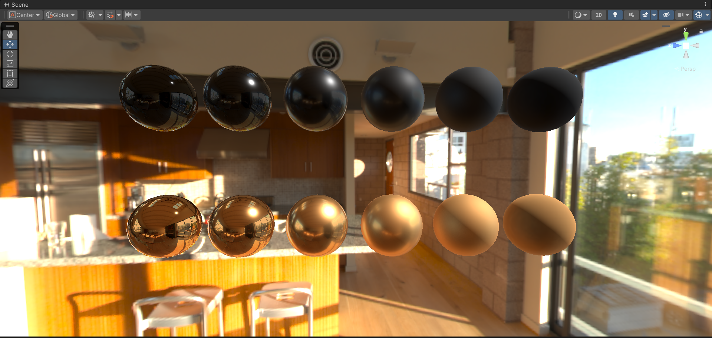

Built-in\
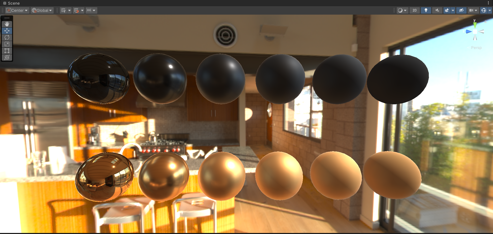
There's some difference between smoothness-roughness mapping, or roughness-mip mapping.

No idea why unity built-in's dielectric reflection looks so blue\
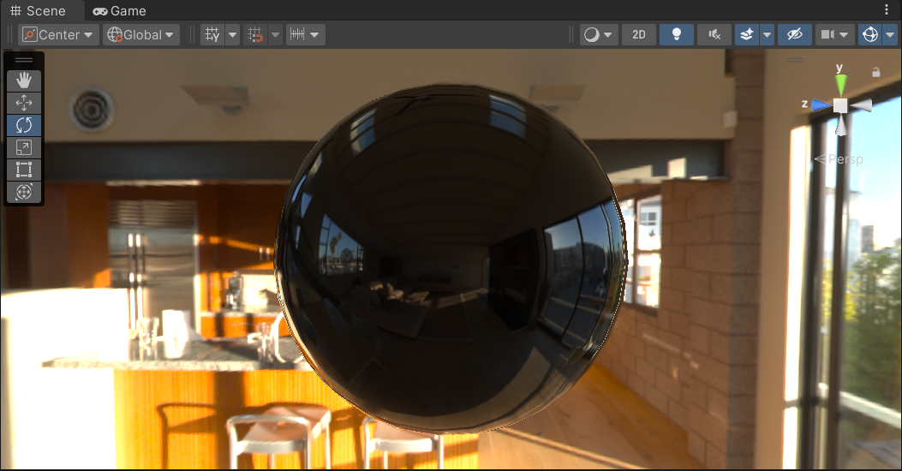

The environment map itself is not that blue!
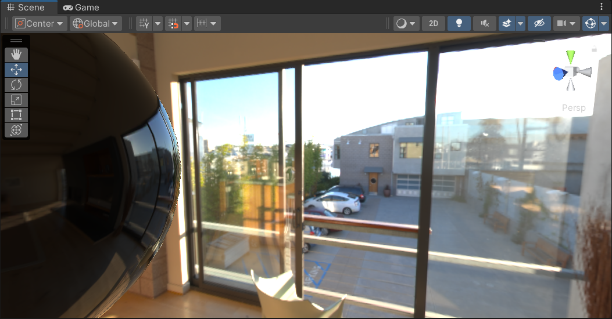


### Remaining Problems
The sample noise with larger roughness is still quite heavy. Need to fix that in the future.
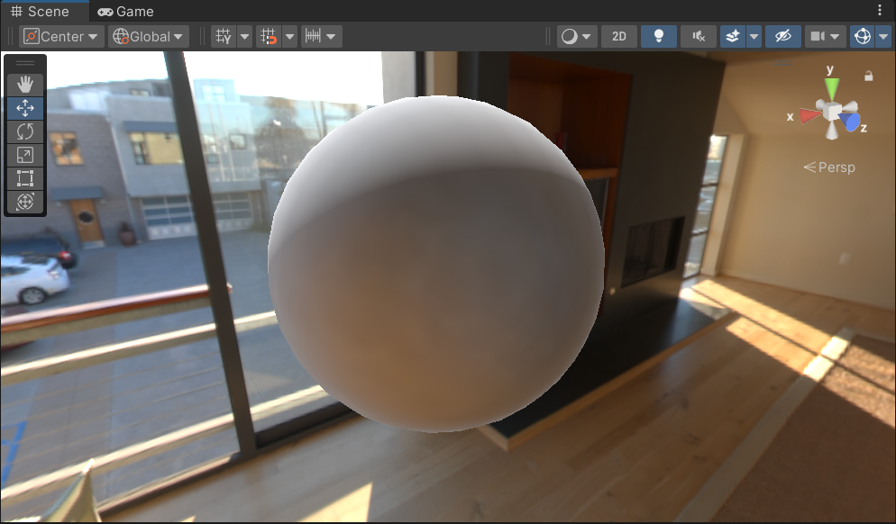