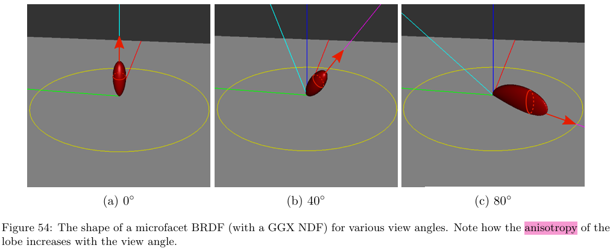
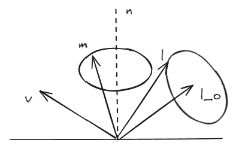
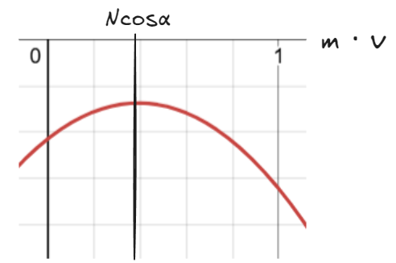
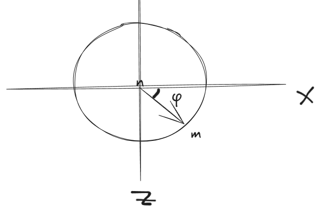
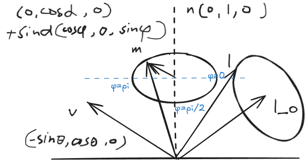
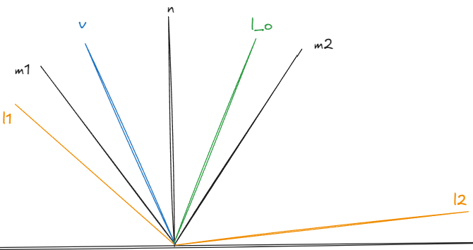
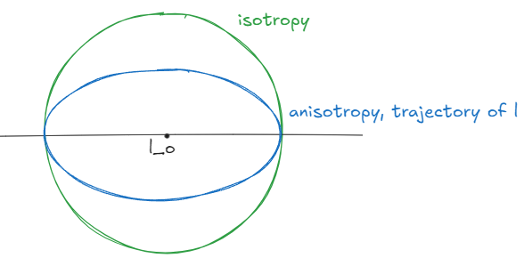

# Why brdf lobe is anisotropic

一切开始于在 [moving_frostbite_to_pbr](https://seblagarde.wordpress.com/wp-content/uploads/2015/07/course_notes_moving_frostbite_to_pbr_v32.pdf) 看到了这么一张图，**疑问 lobe 怎么是 anisotropic 的呢**？(从未想过，虽然这个问题也太 nerd 了。。)\
遂开始推导，过程如下.\
\

Given a fixed roughness, **normal of the microfacet surface $m$ is isotropic around the macro surface normal $n$**.

In order to know the shape of the lobe, only consider $m$ at the boundry.

Assume $m \cdot n = \cos\alpha$, $\alpha$ is the angle between $m$ and $n$, which **stays constant** (depends on roughness).\
\
$l_{o} = reflect(n, v)$, $l=reflect(m,v)$

We want to know the shape of the lobe, which asks this question:
## How $l \cdot l_{o}$ changes, as $m$ rotates around $n$?
As $reflect(n,v)=2(n \cdot v)n-v$,
$$
\begin{align}
l \cdot l_{o} &= (2(m \cdot v)m-v) \cdot (2(n \cdot v)n-v) \\
	&= 4(m \cdot v)(n \cdot v)(m \cdot n) -2(m \cdot v)^{2} - 2(n \cdot v)^{2} + v^{2} \\
	&= 2(2\cos\alpha(m \cdot v)(n \cdot v) - (m \cdot v)^{2} - (n \cdot v)^{2}) + 1 \\
	&= 2L + 1
\end{align}
$$

For a **fixed $v$**, to see how $l \cdot l_{o}$ changes as $m$ rotates around $n$,\
just focus on $L=(2\cos\alpha(m \cdot v)(n \cdot v) - (m \cdot v)^{2} - (n \cdot v)^{2})$.

Assume $\cos\theta=n \cdot v$,
$$
L = -(m \cdot v)^{2} + 2\cos\alpha \cos\theta(m \cdot v) - \cos^{2}\theta
$$
($L$ is function of $m \cdot v$)

### Trival Case
Deal with the trival case first (**view parallel to normal**):\
When $v = n$, $(m \cdot v) = (m \cdot n) = \cos\alpha$, $l \cdot l_{o}$ **is just an constant**,\
which means **the shape of lobe is isotropic**.\
（view 平行 normal，各项同的 lobe）

### Non-trival Case
When $v \neq n$,\
the shape of $L$ looks like this:\

### How $(m \cdot v)$ changes?
Then we need to know,\
how $(m \cdot v)$ changes as $m$ rotate around $n$.

Let $n=(0, 1, 0)$\
$m$ rotates around $n$, \
Let $m=n\cos\alpha + \sin\alpha(\cos\phi, 0, \sin\phi)$. \
Let $v=(-\sin\theta, \cos\theta,0)$.

\

\
Then we have
$$
\begin{align}
m \cdot v = -\sin\theta \sin\alpha \cos\phi + \cos\alpha \cos\theta
\end{align}
$$
Since $\theta$ and $\alpha$ are fixed, it is just functin of $\phi$.\
(关于 $\phi$ 的递增函数)

When $0 < \alpha \leq \theta$,\
**as $\phi$ increases from $0$ to $\pi$, $m \cdot v$ increases from $\cos(\theta + \alpha)$ to $\cos(\theta - \alpha)$**.\
(0->pi,  v,m夹角变小，$m \cdot v$ 变大)

When $0 < \theta < \alpha$,\
**as $\phi$ increases from $0$ to $\pi$, $m \cdot v$ increases from $\cos(\theta + \alpha)$ to $\cos(\alpha - \theta)$**. (pretty much the same)

### Shape of the lobe
Because of symmetry, **the lobe is Symmetric about $plane(v, n)$**, we only need to **consider the shape of half the lobe**. (from $\phi=$ to $\phi = \pi$)\
（反射过程对称，只考虑半边lobe的形状就行.）

When $\theta \geq \alpha > 0$,\
Recall that for $l \cdot l_{o}$ , the Axis of Symmetry is $(m \cdot v)=\cos\theta \cos\alpha$\
（$l \cdot l_{o}$ 的对称轴是 $(m \cdot v)=\cos\theta \cos\alpha$ ）

And $(m \cdot v) \in[\cos(\theta+\alpha), \cos(\theta-\alpha)]$, \
so the shape of the half lobe **depends on how the Axis of Symmetry lands in this interval**.\
（半边 lobe 的形状取决于 $(m \cdot v)$ 区间与对称轴的位置关系）

Notice that\
$\cos(\theta+\alpha)=\cos\theta \cos\alpha-\sin\theta \sin\alpha$,

$\cos(\theta-\alpha)=\cos\theta \cos\alpha + \sin\theta \sin\alpha$.

so the range of $(m \cdot v)$ is just **Symmetric about $\cos\theta \cos\alpha$**!\
（$(m \cdot v)$ 值的区间刚好关于 $\cos\theta \cos\alpha$ 对称）

Therefore,\
as $\phi$ increases from $0$ to $\frac{\pi}{2}$, the angle between $l$ and $l_{o}$ **first decreases** ($l\cdot l_{o}$ increases),\
then as $\phi$ increases from $\frac{\pi}{2}$ to $\pi$, the angle between $l$ and $l_{o}$ **then increases** ($l\cdot l_{o}$ decreases).

If we cut the lobe perpendicular to $l_{o}$, the slice of the lobe is **an flat oval**:

When $0 < \theta < \alpha$,\
$(m \cdot v) \in[\cos(\theta+\alpha), \cos(\alpha - \theta)]$,\
the derivation is the same as above, it doesn't change our conclusion.
## How lobe shape changes with view angle?
We already deal with the trival case,\
when $\theta=0$, the lobe is **isotropic**.

When $\theta \neq 0$,\
since $l \cdot l_{o}=2L + 1$,\
the larger $L$ is, the flatter the lobe is.\
（lobe 有多扁，取决于 $l \cdot l_{o}$ 有多大）

$L_{max}=-(1-\cos ^{2}\alpha)\cos ^{2}\theta < 0$\
As $\theta$ increases, $\cos\theta$ decreases, then $L_{max}$ increases, the lobe becomes flatter.\
-> **the anisotropy of the lobe increases with the view angle**.\
（ $\theta$ 越大，lobe 越扁.）

